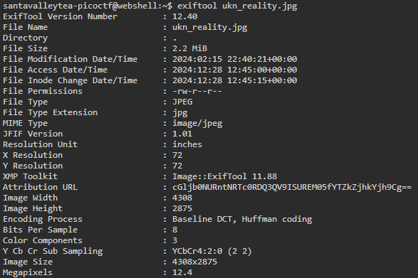
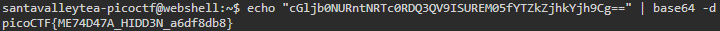

Here, given a .jpg file called `ukn_reality.jpg`, I was tasked to find the hidden flag.

Since this is a forensics challenge centered around an image, I went over to an online [Steganographic Decoder](https://futureboy.us/stegano/decinput.html) to look for a more 'visual' solution to the challenge.
However, I was given the following message.  
`The flag is not here maybe think in simpler terms. Data that explains data.`  
 
This prompted me to look at the data of the jpg file through the command `exiftool ukn_reality.jpg`. 
This command allows you to look at the metadata of a selected file, exactly what the message meant by "data that explains data".  
Inspecting the output, I noticed that the attribution URL contains something that looks like base64 encoding, which is evident due to the use of the following characters: `A-Z, a-z, 0-9, +, /` as well as `=` at the end for padding.  
 
  
 
From here, I simply used the command `echo "<cGljb0NURntNRTc0RDQ3QV9ISUREM05fYTZkZjhkYjh9Cg==> | base64 -d` to decode the string, which gives us the flag.  
 
  
 
flag = picoCTF{ME74D47A_HIDD3N_a6df8db8}
