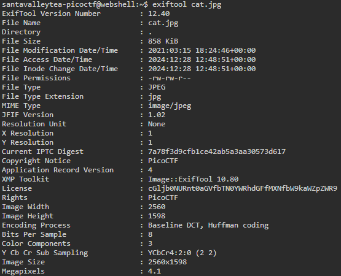

I was given a .jpg file called `cat.jpg` and tasked to find the hidden flag.  

Unlike in the `CanYouSee` challenge, rather than using a steganographic decoder, I decided to go straight to checking the file type, to see if it was a legitimate JPG file.  
I used both the `file cat.jpg` and `binwalk cat.jpg` to check the file type.  
 
 
 
 
 
And as it turns out, there was nothing wrong with the file type.  
So, I decided to simply use `exiftool cat.jpg` to check the metadata of the image, and here I found a base64 string next to the license section.  
 
 
 
Using the command `echo "encoded_string" | base64 -d` I found the flag.  
flag = picoCTF{the_m3tadata_1s_modified}

From PicoCTF
