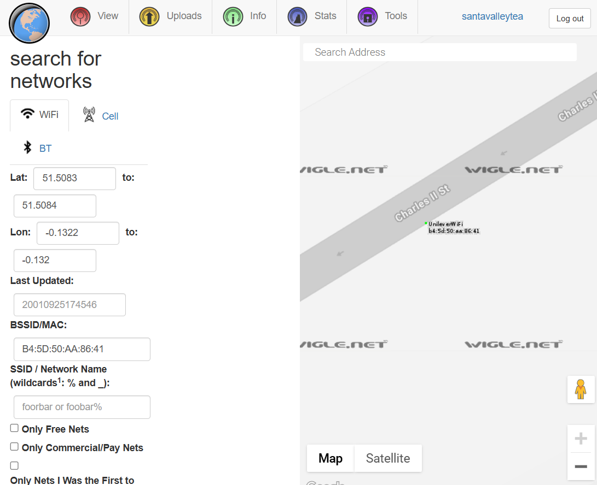

  
This is an OSINT (Open Source Intelligence) CTF challenge.  
The challenge starts off with giving a downloadable file, which is the famous Windows XP background image.  
  
The first thing I did was to download the file and use the `exiftool` command to output the metadata of the image.  
  
As shown, I can see a variety of information and the first thing that I noticed, was the copyright section, which sats `Copyright: OWoodflint`.  
I did a google search on the name and a couple websites (Twitter, Github, WordPress) popped up that I assumed related to the challenge. I first took a look at the twitter page.  
  
This gave the answer to the first question. `What is this user's avatar of? : cat`.  
I then looked at the user's first post and saw the BSSID being provided. I used the website [WiGLE: Wireless Network Mapping](https://wigle.net) to find out the SSID of the WAP he connected to, as well as his geolocation.  
  
This gave me what I needed for two questions.  
`What is the SSID of the WAP he connected to? : UnileverWiFi`  
`What city is this person in? : London`  
I then turned my attention to his github page.  
  
This gave me another answer, his email address.  
`What is his personal email address? : OWoodflint@gmail.com`  
Additionally, the github page also confirmed that he was in/from London.  
The last page that showed up in the Google search was his WordPress blog site.  
  
The homepage gave me another answer, which was where he had gone on holiday.  
`Where has he gone on holiday? : New York`  
The final question was a bit trickier, but turns out it was hiding in plain sight.  
I first thought of using `hydra` to brute for his login, but I could not quite find the login page that was within the scope of this challenge. So I decided to look at the page source to see anything interesting.  
At first, it looked like any other page source, but there was one interesting line that caught my attention.  
  
Right underneath the statement on the homepage, there seems have been another text that says `pennYDr0pper.!`, but I was not able to see this on the homepage itself. That was until I realized it was in white.  
  
This was the answer to the final question.  
`What is the person's password? pennYDr0pper.!`  
From TryHackMe
