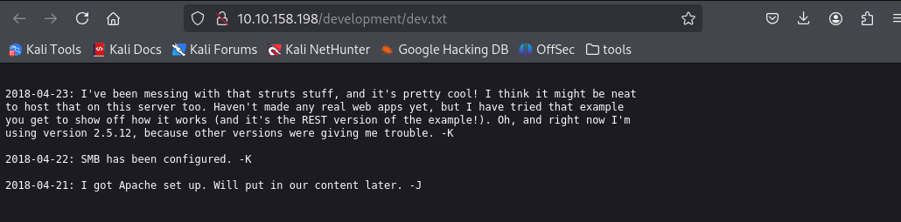
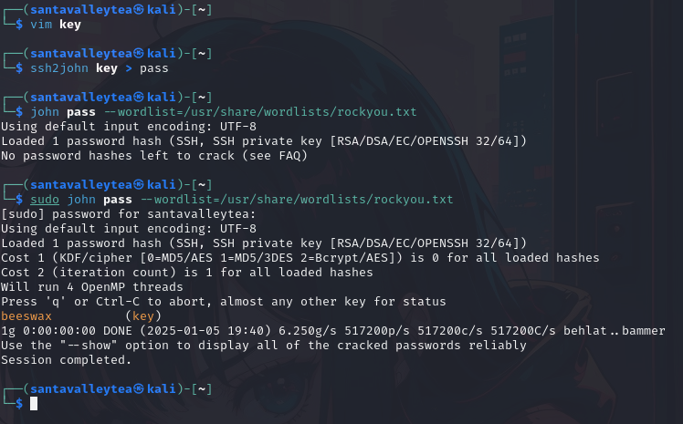

  
  
This challenge focused on the basics of penetration testing, using tools such as `feroxbuster`, `hashing`, `enum4linux` and many more!  
I started off, like with any other challenge, with an `nmap` scan with the given IP address; `10.10.158.198`.  
  
I saw that port `80` was open so I decided to input the IP into the URL. I received the following page.  
  
In addition to this, the page source showed the following.  
  
The comment here was interesting, and this to me implied that there maybe a dev directory or file of some sort within the page.  
So, I decided to `feroxbuster` to look for directories within the given IP address. You can also use tools like `gobuster` for this.  
  
As seen above, there are two `.txt` files in the `/development` directory. This gave me the first answer to the question.  
`What is the name of the hidden directory on the web server? : development`  
I then decided to check both of them out.  
  
  
From these, I was able to gather a couple information. The first is to do with SMB, to which I thought of using an `smbclient` to gather more information. In addition, it was stated that there was something regarding a weakpassword within `/etc/passwd`.  
I then decided to use `enum4linux` to enumerate information from Samba systems, as shown here:  
  
This gave me a variety of details, but one that stood out to me were the following.  
  
The `anonymous` sharename could be used to gain access to the `smbclient` mentioned earlier.   
  
This was the main turning point, and I found out the two users I was concerned with in this challenge. Jan and Kay. This gave me the answer to two questions.  
`What is the username? : jan`  
`What is the name of the other user you found?: kay`  
From the `nmap` scan earlier, I knew that were related to `ssh`, so I utilized `hydra` to brute force the password for jan's ssh.  
  
This gave me the password I was looking for, and thus answers the following.  
`What is the password? : armando`  
Furthermore, you can answer the following question as well.  
`What service do you use to access the server? : ssh`  
I then logged on to the `ssh` with the newly acquired password.  
  
I also found two directories in the `/home` directory within.  
  
Upon looking into `/kay` I found a file called `pass.bak`, but I was unable to access it.  
The following took some time, but I looked into the different files within the directories by using the command `ls -la` to see permissions for each that `jan` had.  
  
I looked through a few of them, but I eventually found something interesting in the `.ssh`.  
  
I then viewed the contents of `id_rsa` and found a private key that seemed to be useful.  
  
I copied this over to a `key` file on my local machine, hashed it using `ssh2john` and using the same tool, decrypted the hash which gave me the following output.  
  
Now that I had the password, I went back to the target machine where I was logged in as `jan`, and entered the passphrase for the key `id_rsa`.  
  
I displayed the contents of the `.txt` file and finally got the answer to the final question.  
`What is the final password you obtain? : heresareallystrongpasswordthatfollowsthepasswordpolicy$$`  
From TryHackMe

