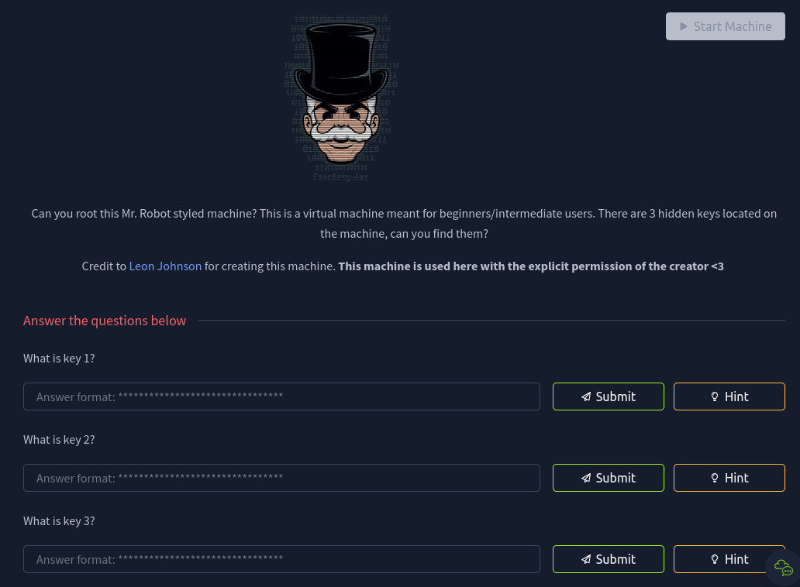   
This challenge is based on the show, "Mr Robot" and I have categorized it as a penetration testing challenge.  
It starts off by giving us the machine IP for us to work with, in this case `10.10.165.81`.  
Here, I used the `nmap` tool to scan the IP address given, to see which ports are open.   
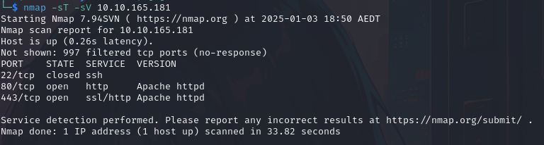   
We see that there are two ports open. Port `80` refers to HTTP and `443` refers to HTTPS. This indicated to me
that I could access it using a web browser. Thus, inputting the IP address into the URL bar gave the following.  
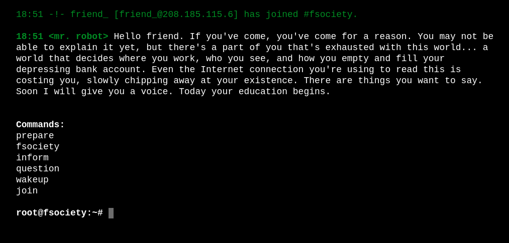  
This web page was really cool and I advise anyone who is attempting this challenge to check out the commands available on the front page. However, for this
purpose, I decided to check existing directories using `gobuster`.  
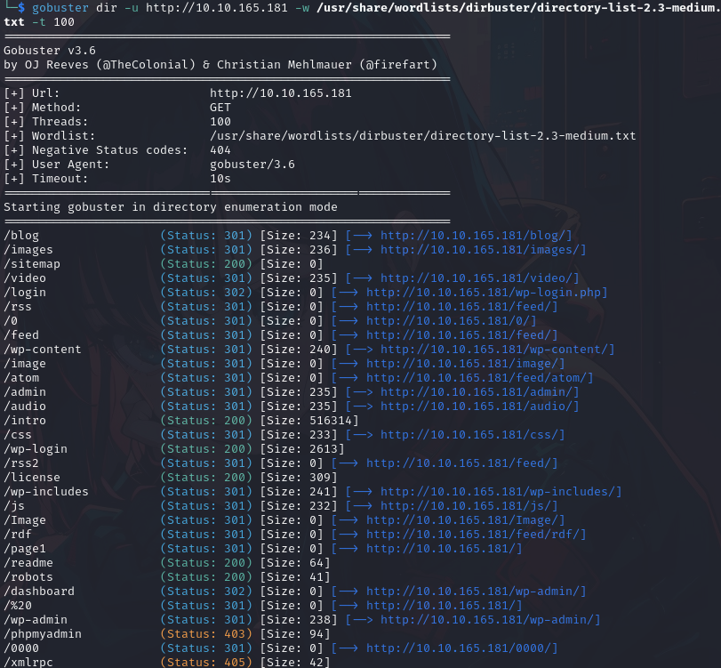  
The `gobuster` tool showed a variety of directories, but some stood out to me more than others. The first one that I decided to look into was
the `/robots` directory. Entering this into the URL bar gave us:   
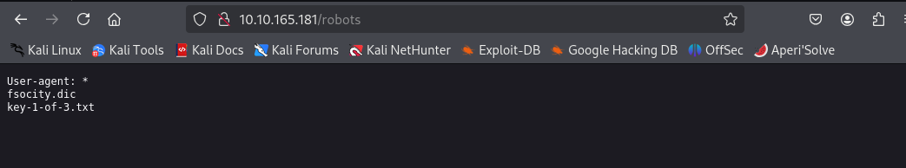  
There are a couple options here, but I first inputted the `key-1-of-3.txt` into the URL, as this was a direct clue to the first of three flags.  
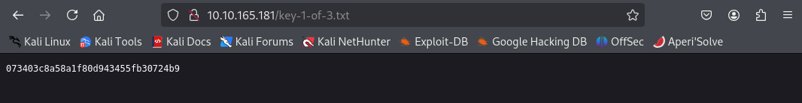  
Rather than a clue, it gave me the flag itself. Now that we have the first key, we proceed to the next.  
I inputted the other directory in the `robots` directory where we found the first key, and gave me a pretty extensive list of what seemed to be either passwords or usernames, this was saved as `fsocity.dic`.  
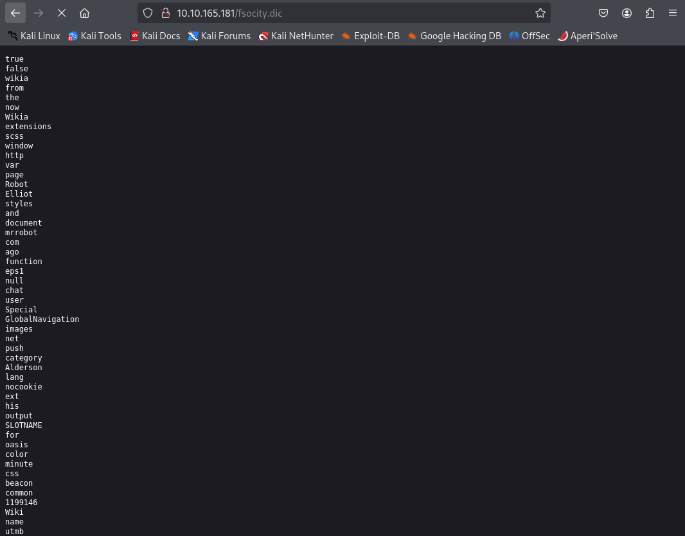  
This means that there must be some login page that we must find. Looking back at the list of directories through `gobuster`, I saw one that was called `wp-login`.   
I entered this into the URL and got a login page for WordPress (I forgot to screenshot this part).  
So now that I'm on the login page, I am tasked to figure out both the username and the password. I decided to use the login brute-force tool called `hydra`.  
However, I must mention that this option of brute forcing did not work for me due to some technical issues, but I will share it regardless.   
Before we use `hydra`, we must know the format in which both the user and password is in when it is communicating with the server or database.  
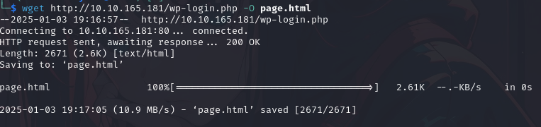  
I used the `wget` tool to take the source code of the login page and save that as a `.html` file in my desktop. I then figure out, from the image below, that the name of the username is stored as `log` as seen in `name=log` and the password as `name=pwd`.  
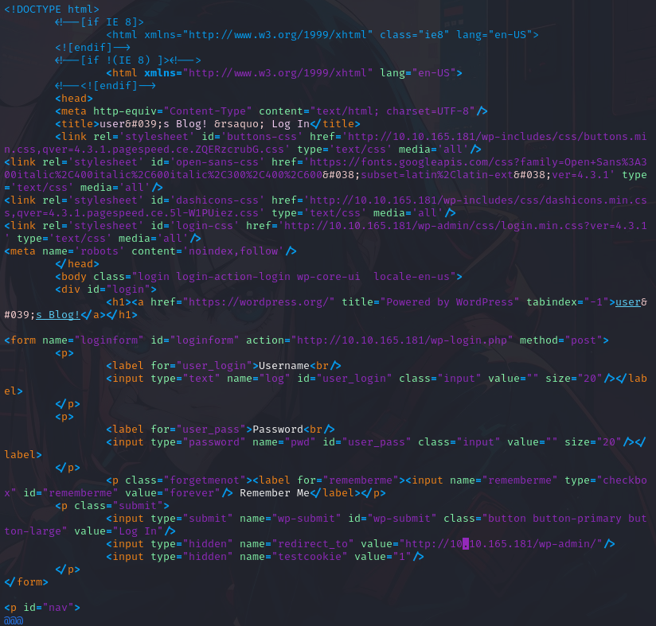  
The reason for the importance of this information is due to how `hydra` is formatted in the command line.   
The format is as follows: `hydra -l [user or user list] -p [password or password list] [target IP] http-post-form [address with the provided info from above]`.
Thus, I inputted the following to get this particular result.  
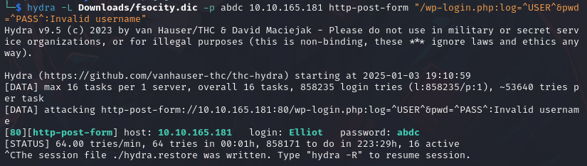  
I used a random password just to first figure out the usename with the list provided, and seemed to be that `Elliot` is the username we were looking for.  
Now, to figure out the password. I initially used `hydra`, as well as another tool called `wpscan`, but as shown below, for some reason it was simply not working for me.  
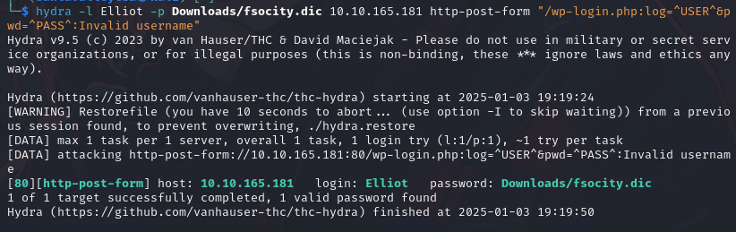  
I then had to switch up my approach. This one took a while as I was in a rather stale state looking through a bunch of directories and files I had access to. But then, I stumbled accross this interesting directory.  
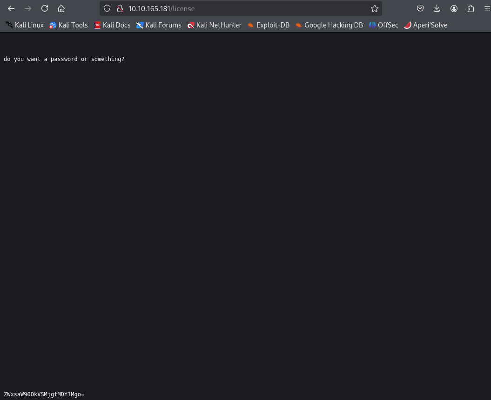  
This was one of the directories listed by `gobuster` from earlier, and when I scrolled all the way to the bottom, it gave me a string that looked to me like a `base64` encrypted string. I used an only decoder and was finally able to get the password I was looking for, alongside the username to confirm it.  
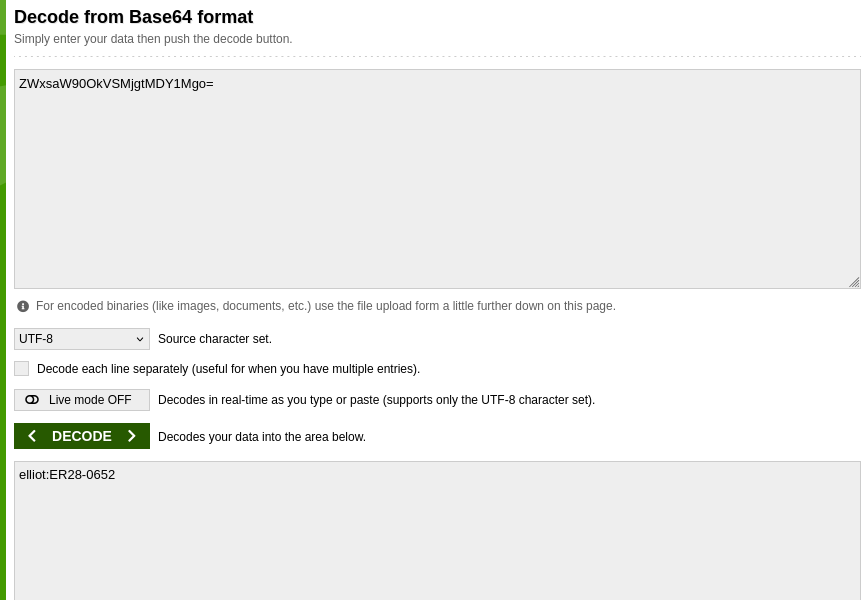  
After inputting both the username and the password in the `wp-login.php` page, I was met with a page specifically for admins.  
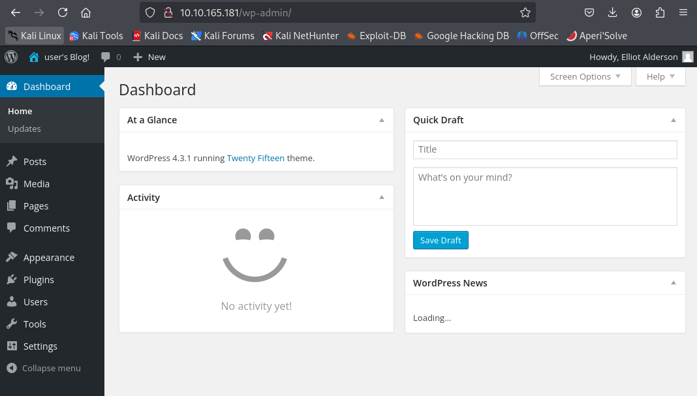  
I looked through it and found an editor in the appearance tab. This was where I could deploy a PHP payload to start my reverse shell process. The link to the payload is [here](https://github.com/pentestmonkey/php-reverse-shell/blob/master/php-reverse-shell.php). I then had to change the IP address to be my own and the port to be `443`, although you could use any open ports on your end.  
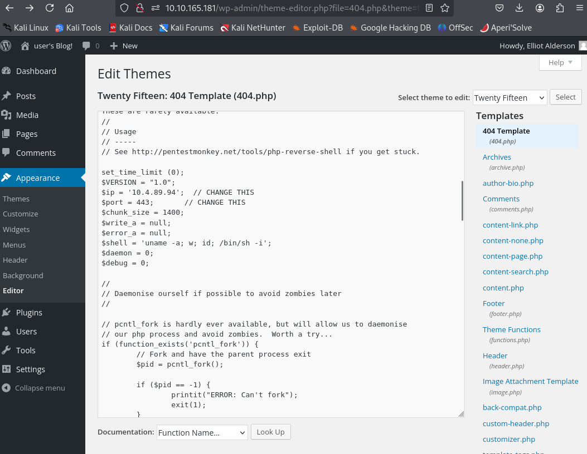  
You could put this into any one of the templates listed on the right, but I decided to edit the 404 template at the very top.  
We can now start our `netcat` by inputting the following command `nc -lnvp 443` to start listening for any connection to port `443` and typed in `404.php` in the URL as a directory for the website. This then established the connection.  
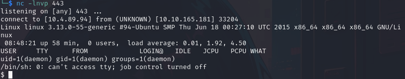  
Now I was able to access the files and look for the second and third flag of the challenge. After looking through some files, I changed the directory to the `/home` directory and found two interesting files, one of which was the second key. However, I was met with the following issue.  
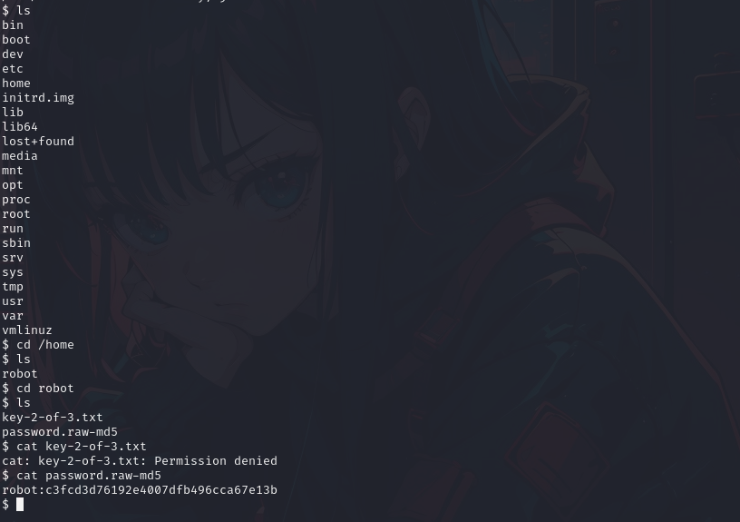  
I was denied persmission to view the contents of the file, but that was not the case for the `password.raw-md5` file, which gave me an `md5` hash string. This looked like a user-pass key where the username is `robot` and the password is the `md5` hash. You could use a tool like `John the Ripper`, but I decided to use an only hash cracker and got the following string: `abcdefghijklmnopqrstuvwxyz`.   
I then decided to change my user to `robot` using `su robot`, but I was met with another problem; the command `su` must be run from a terminal.   
This was a relatively easy fix as all you have to do is type this into the command line:  
`python3 -c 'import pyt;pty.spawn("/bin/bash")`. This upgrades the limited shell into a more interactive shell.  
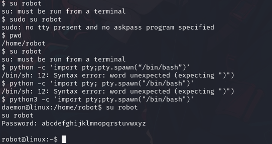  
As shown, this allowed me to log into and switch my user to `robot` using the password I cracked earlier, and thus allowing me to obtain my second flag of the challenge.  
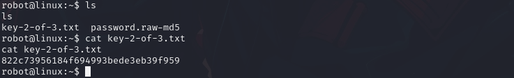  
The final flag for me was the trickiest, since I was lost on what to do, so I decided to use the hint given on the tryhackme page. The hint was simply `nmap`.  
However, the hint wasn't to use `nmap` but rather to find something that included it.  
Skipping over a rather tiresome search, I found a directory that seemed suspicious as per the following.   
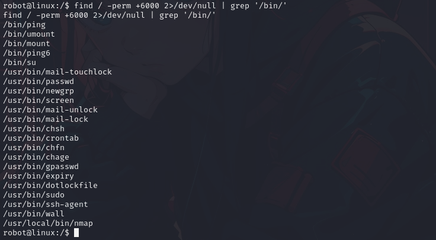  
As you can see, there exist a directory: `/usr/local/bin/nmap`, so I decided to `cd` to it.  
I used the command `nmap --interactive`, which was used in an older version of `nmap` to start an interactive shell for running `nmap` commands, and by doing so, I was able to navigate to the root directory.  
Finally, I was able to find the third and final flag I was looking for.  
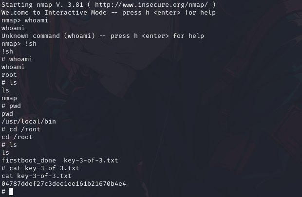  

This was a rather challenging CTF for me, but taught me a lot of tools and skills for penetration testing.  

From TryHackMe
