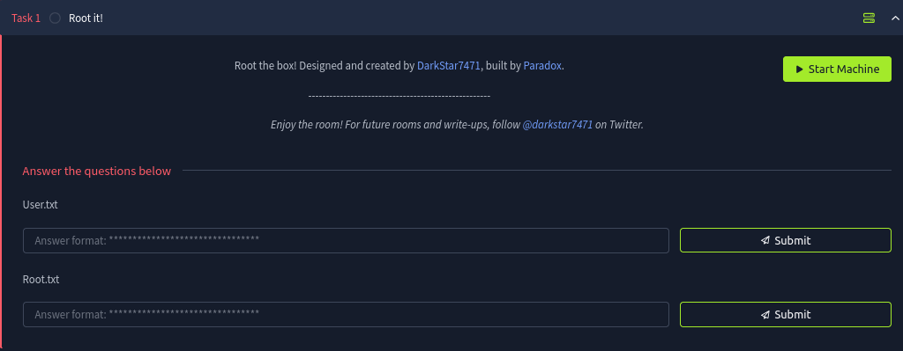  
This challenge starts off with the following web page.   
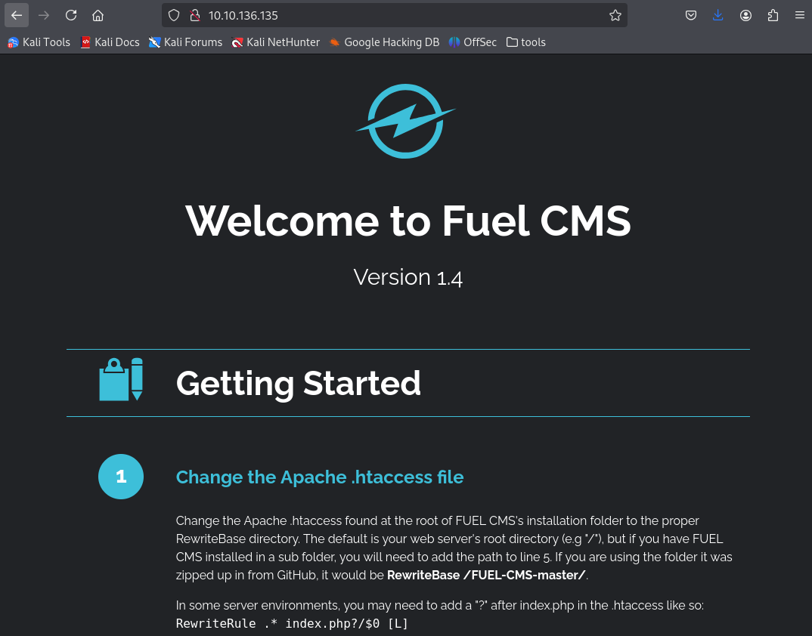  
I looked through the website to see if I can find anything useful for this challenge.  
The first thing that stood out to me was section on the page where it gave me a directory, username and password.   
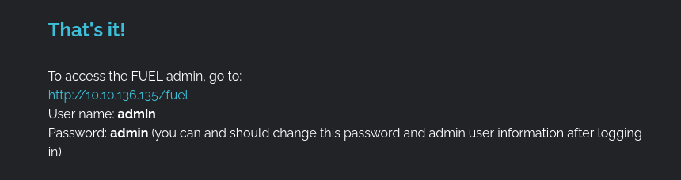  
I then redirected to the page.   
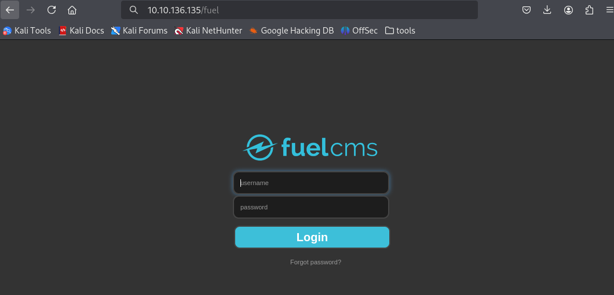  
Here I entered the given username and password, which successfully logged me in to the dashboard.  
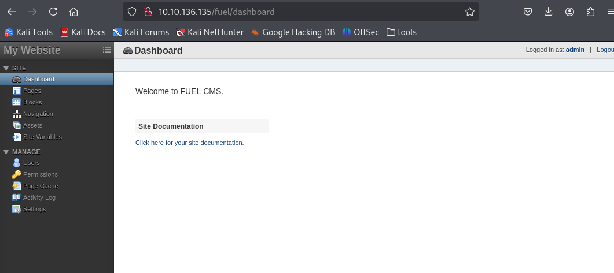  
I looked through the page but there didn't seem to be anything of interest. From the very first page I was directed to at the start of the challenge, I noticed that they gave us the version number. Thus, I decided to do a quick google search on `Fuel CMS Versions 1.4.0` and this gave me a known vulnerability and an exploit.   
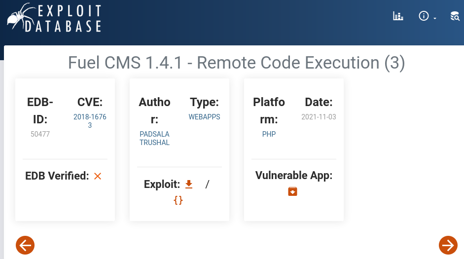  
I installed the exploit which was saved as `50477.py` and utilized this through the command line.  
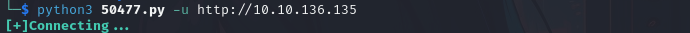  
I was now connected and looking through the directories, I had found the first flag.  
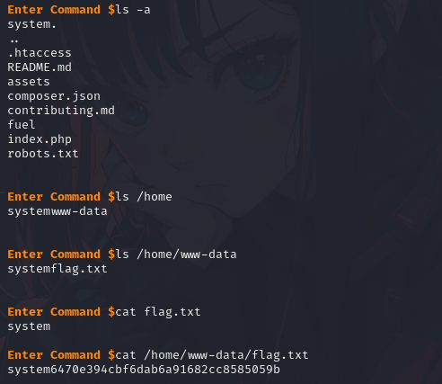  
`User.txt : 6470e394cbf6dab6a91682cc8585059b`  
Now, I needed to escalate my privileges to root access. Looking around the directories, I found a database using the following `cat fuel/application/config/database.php`. Here I found the username `root` and the password `mememe`, which could be used to gain root access.   
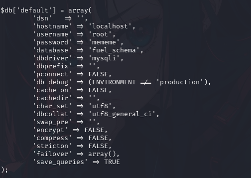  
I then entered the following on the target machine.   
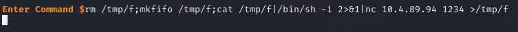  
This was taken from this [website](https://pentestmonkey.net/cheat-sheet/shells/reverse-shell-cheat-sheet) which gives you a variety of options for creating a reverse shell.   
I made sure the IP address was changed to mine and the port to be any open port on my end, in this case `1234`.   
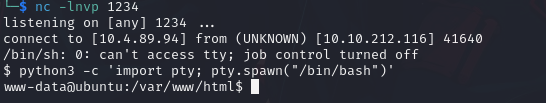  
As shown, I successfully conducted the reverse shell, and I was able to switch to the root user using `su root` with the password that I found earlier in the database.  
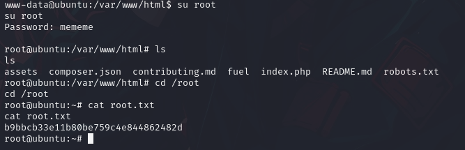  
Here, I found the `root.txt` file that contained the last flag to complete the challenge.  
`root.txt : b9bbcb33e11b80be759c4e855862482d`  
From TryHackMe
