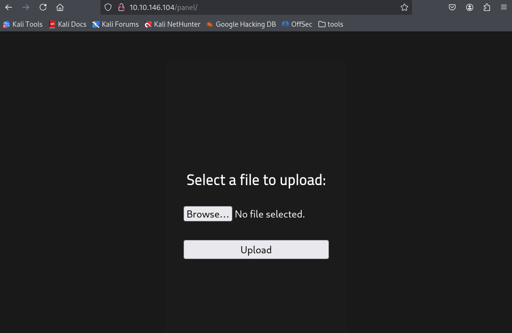
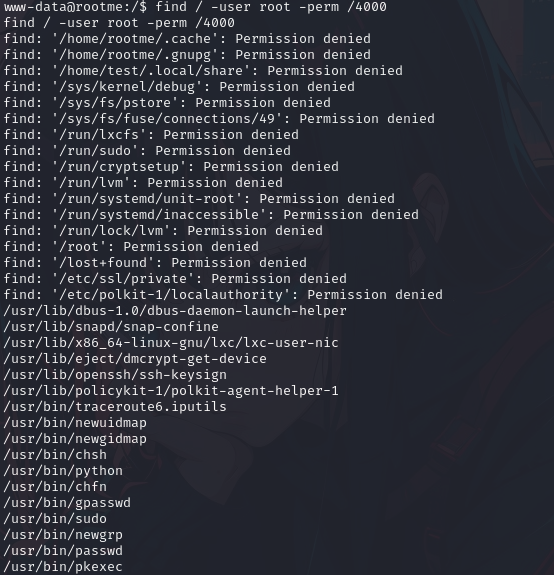

This challenge involves both web applications and privilege escalation. It is a guided challenge where we are required to fill in 'checkpoint' like answers to make sure we are on the right track.   
I first used `nmap` to scan the IP address given.  
  
We now know that there are 2 ports open, which answers the first question.  
I then scanned the IP with the port 80 using `nmap`'s `-sV` option to find out the service version.   
  
This gives us the answer to the second question, which is `Apache httpd 2.4.29`.  
Additionally, port 22 is the default port for the Secure Shell (SSH) protocol. Hence, the answer to the third question is `ssh`.  
I then used `gobuster` to find the directories on the web server provided.  
  
I find two interesting directories, `/panel` and `/uploads`. I first check out the `/panel` directory which gives us the following web page.   
  
I then used the PHP reverse shell found on this [github repository](https://github.com/pentestmonkey/php-reverse-shell) to upload a payload. Make sure to change the IP address of the payload to your own and an open port
(in my case, I chose 1234). Then, set up a `netcat` listener on the port of choice and upload the payload.   
  
  
I have now gained access to the shell, and thus was able to find the first flag in `user.txt`.  
  
Now, I needed to gain root access. This requires some searching, but one way this could be done is by running the following command: `find / -user root -perm /4000`. This command is essentially looking for a file with SUID (Set User ID) permission, which can then be run with root access. After looking through, I saw that there was something interesting with the `/usr/bin/python`directory.  
  
From here, you can go to [GTFOBins](https://gtfobins.github.io/) to look for the Python GTFO bin, which will give us a command that is curated to escalate privileges. Then, I simply placed this command `python -c 'import os; os.execl("/bin/sh", "sh", "-p")'` into the shell that I gained earlier and it gives us root access!   
  
From TryHackMe
